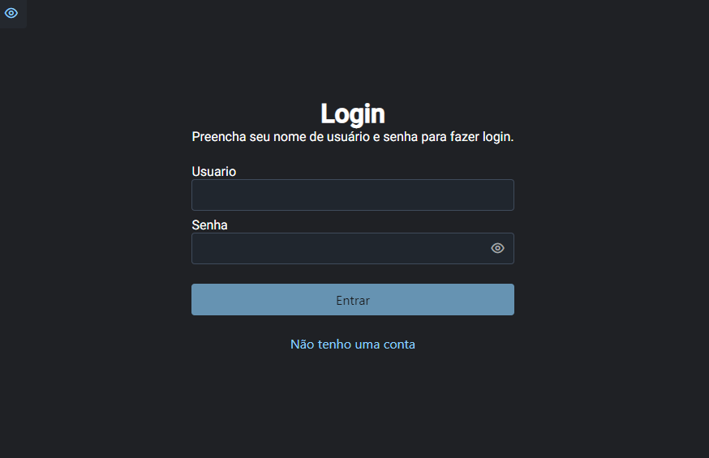
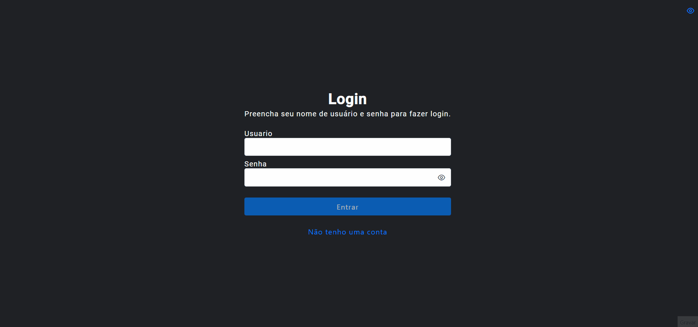

# Fleet Manager Frontend

This project was generated with [Angular CLI](https://github.com/angular/angular-cli) version 12.1.1.

## Demo

<!-- 
 -->

## Tecnologies

This project was developed using:

-   [Angular eslint](https://github.com/angular-eslint/angular-eslint)
-   [Primeng](https://www.primefaces.org/primeng/)
-   [Prime Flex](https://www.primefaces.org/primeflex/flex)
-   [Sweetalert2](https://sweetalert2.github.io/)

## Utils

<a href="https://dev.to/gsarciotto/migrating-and-configuring-eslint-with-angular-11-3fg1">Doc Angular eslint</a>

## Backend Prod NestJS

<a href="https://fleet-manager-backend.herokuapp.com/docs" target="_blank">Heroku NestJS</a>
